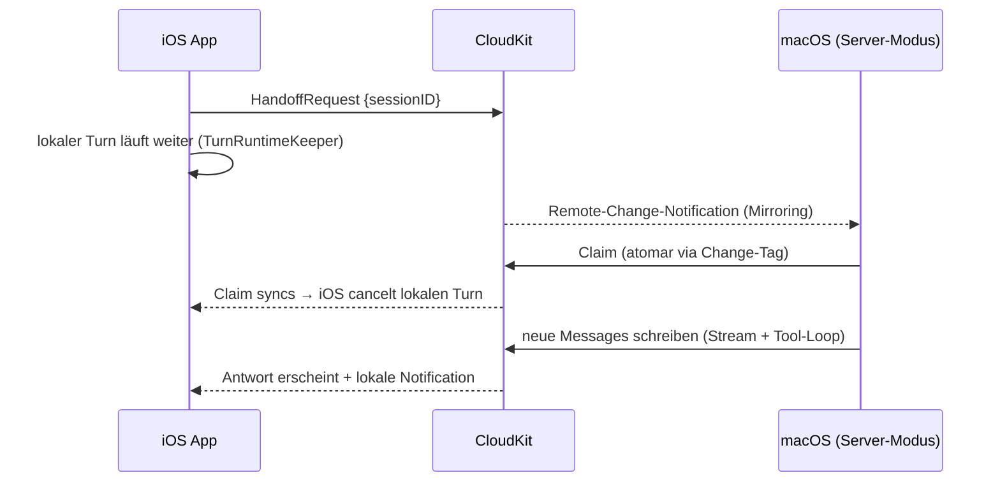

# Plan: Server-Handoff (macOS-Server übernimmt laufende Turns)

> Status: **Idee / noch nicht umgesetzt** (Stand 2026-08-12).
> Vorstufe bereits eingebaut: `BGContinuedProcessingTask` (iOS 26+) bzw.
> `beginBackgroundTask` (iOS 17–25) halten Turns am Leben, solange die App nur
> im Hintergrund ist (`TurnRuntimeKeeper`). Der Server-Handoff bleibt die
> einzige Lösung für «App wurde geschossen» — iOS beendet Continued-Processing-
> Tasks ohne Vorwarnung, wenn die App im App-Switcher weggewischt wird.

## Grundidee

**Kein separates Server-Binary:** die normale **macOS-Chatter-App** bekommt
einen Server-Modus (Toggle in den Settings). Sie hat bereits alles Nötige:
`ChatEngine`, `OllamaService`, MCP-Verbindungen, SwiftData-Stack und — über
dieselbe Apple-ID — dieselbe private CloudKit-DB (`iCloud.team.budo.chatter`).
Jeder Mac mit laufender Chatter-App ist damit ein potenzieller Handoff-Server.

Geht die iOS-App in den Hintergrund (oder soll beendet werden), übergibt sie
den laufenden Turn an einen erreichbaren Mac; das Ergebnis erscheint via
CloudKit-Sync auf allen Geräten.

## Was der macOS-App dafür fehlt

1. **Handoff-Beobachter**: Observer auf `NSPersistentStoreRemoteChange`
   (SwiftData-Mirroring) + Claim- und Ausführungslogik, gesteuert über einen
   «Server-Modus»-Toggle in den Settings.
2. **`HandoffRequest`-`@Model`** (inkl. Claim-Feldern `claimedByDeviceID` +
   Heartbeat) → CloudKit-Schema-Deploy vor Release nötig.
3. **Wachhalten**: App Nap → `ProcessInfo.beginActivity(.userInitiated)`
   während Turns; System-Sleep → «Wake for network access». Die App läuft
   ohnehin ohne Fenster weiter.

## Architektur

### Steuerkanal: CloudKit (kein Listener nötig)

Der Handoff läuft über CloudKit selbst — ein eigener Netzwerkkanal entfällt:

1. iOS schreibt einen `HandoffRequest`-Record (`@Model`: Session-ID,
   Erstellungs-Timestamp) und lässt den lokalen Turn vorerst weiterlaufen.
2. Der Mac beobachtet SwiftData-CloudKit-Mirroring
   (`NSPersistentStoreRemoteChange`-Notifications) und sieht neue Requests
   typischerweise **innerhalb weniger Sekunden** — kein Polling, kein
   Silent-Push-Handling nötig.
3. Der Mac claimt den Request atomar (Record-Change-Tag; bei mehreren Macs
   gewinnt genau einer) und führt den Turn aus.
4. Sobald der Claim bei iOS syncs, cancelt iOS den lokalen Turn. Läuft die
   lokale Hintergrundzeit vorher ab, ist das nicht tragisch: Der Server
   setzt den Turn aus der Session-History fort (Teil-Content bleibt
   persistiert, siehe Race-Regel unten).

**Warum CloudKit hier reicht, obwohl es «kein Echtzeitkanal» ist:** Der User
hat die App verlassen — Pickup-Latenz von Sekunden bis Minuten ist
wahrnehmbar irrelevant, und der `TurnRuntimeKeeper` (seit 2.4) überbrückt
die Wartezeit lokal. Zudem gilt Queue-Semantik gratis: Ein offline Mac holt
verfallene Requests später nach (mit Alter-Limit, z. B. 2 h).

**Was dadurch entfällt** (gegenüber der Listener-Variante): `NWListener`,
Bonjour-Advertise, `NSBonjourServices` in der Info.plist, das
`network.server`-Entitlement, Token-Pairing (gleiche Apple-ID **ist** die
Authentisierung), Tailscale-Workarounds — und jede offene Port-
Angriffsfläche.

**Risiko:** Merkt der Mac nichts (App geschlossen, iCloud hängt), verfällt
der Request still — Verhalten wie heute ohne Server: Der lokale Turn läuft
mit `TurnRuntimeKeeper` so lange weiter, wie iOS erlaubt, danach sauberer
Abbruch mit Teil-Content + Notification. Mitigation beim Start: beim
App-Launch offene Requests prüfen.

**Notification-Lücke (bewusst dokumentiert):** Übernimmt ein Mac, feuert die
Completion-Notification auf dem **Mac**, nicht auf dem iPhone — die Antwort
kommt dort nur still per Sync an. Zwei Umsetzungsdetails:

1. **Suppression beim Claim-Cancel**: Cancelt iOS den lokalen Turn wegen
   eines Handoffs, darf `notifyCompletionIfNeeded` **keine** Notification
   schicken (sonst «Reply ready» mit halbfertigem Preview). `stopTurn`
   braucht dafür einen Grund-Parameter.
2. **Ausbau (Schritt 2)**: Der Server markiert den Request als completed;
   ein `UIApplicationDelegateAdaptor` auf iOS wertet den ohnehin
   ankommenden CloudKit-Silent-Push aus (`remote-notification`-Mode
   existiert) und postet die Notification lokal. Silent Pushes sind
   best-effort — die Daten syncen unabhängig davon, nur die Mitteilung
   kann ausfallen.

**Optionaler Ausbau:** Ein Bonjour-Listener bleibt als späterer Beschleuniger
(sub-Sekunden-Handoff) bzw. für den reinen Lokal-Modus ohne iCloud denkbar —
bewusst nicht Teil von v1.

### Ablauf im Detail

1. iOS bemerkt Hintergrund-Wechsel (`scenePhase`) bzw. drohende Expiration
   des Background-Tasks.
2. iOS schreibt den `HandoffRequest`; der lokale Turn läuft vorerst weiter.
3. Der Mac sieht den Request via Remote-Change-Notification, claimt ihn und
   führt den Turn aus (Tool-Loop inkl. MCP — stdio-MCP auf dem Mac ohne
   Sandbox-Probleme).
4. Claim syncs zu iOS → iOS cancelt den lokalen Turn (Teil-Content bleibt
   wie bei `CancellationError` stehen).
5. Server speichert Messages → CloudKit → iOS zeigt sie beim nächsten Sync;
   zusätzlich lokale Notification «Antwort fertig» (Infrastruktur existiert
   seit 2.4, siehe `TurnRuntimeKeeper`).

## Bekannte harte Punkte

1. **Race um die halbfertige Nachricht**: Beim Handoff existiert lokal schon
   eine Streaming-`Message`. Regel: iOS markiert sie als abgebrochen, der
   Server hängt eine **neue** Assistant-Message an (kein Überschreiben).
2. **`orderIndex` ist nicht gerätesicher**: `session.nextOrderIndex` zählt
   lokal; schreiben zwei Geräte gleichzeitig, kollidieren Indizes. Für den
   Handoff-Fall begrenzbar (iOS hat gestoppt), aber als Dauerzustand braucht
   es eine Regel (z. B. Server nutzt `max(orderIndex)+1` relativ zum eigenen
   Sync-Stand; Clients sortieren tolerant).
3. **Server muss in einer eingeloggten GUI-Session laufen** (LaunchAgent) —
   ein echter headless Daemon kommt an die private CloudKit-DB praktisch
   nicht ran.
4. **API-Key**: iCloud-Keychain synct auf den Mac (gleiche Apple-ID), sonst
   eigener Keychain-Eintrag auf dem Server.
5. **CloudKit-Schema**: jede `@Model`-Änderung muss weiterhin vor TestFlight
   nach Production deployed werden (siehe AGENTS.md).

## Alternativen (verworfen bzw. zurückgestellt)

- **Bonjour-Listener (`NWListener` + `POST /handoff`)**: ursprünglich als
  Kernstück geplant, heruntergestuft — sub-Sekunden-Handoff ist ohne User in
  der App wertlos, und die CloudKit-Variante spart Entitlement, Pairing,
  Bonjour-Plist und Angriffsfläche. Bleibt als späterer Beschleuniger /
  Lokal-Modus-ohne-iCloud-Option.
- **BGTaskScheduler/BGProcessingTask**: muss im Voraus geplant werden, nicht
  für usergestartete Arbeit.
- **Background-`URLSession`**: NDJSON-Streaming darüber wäre ein grosser
  Umbau, unverhältnismässig.

## Offene Entscheide bei Umsetzung

- Handoff automatisch bei jedem Hintergrund-Wechsel oder nur bei langen
  Turns / manuell?
- Soll der Server auch **ohne** Handoff autonom Reminder-Actions ausführen
  können (er sieht sie ja in CloudKit)?
