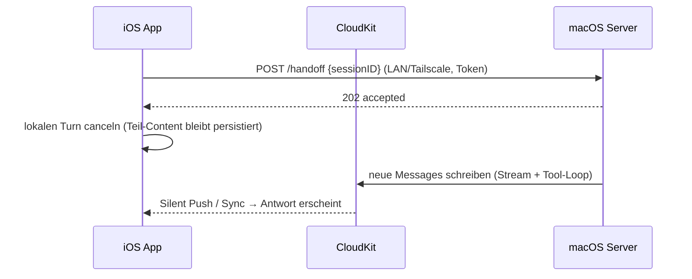

# Plan: Server-Handoff (macOS-Server übernimmt laufende Turns)

> Status: **Idee / noch nicht umgesetzt** (Stand 2026-08-12).
> Vorstufe bereits eingebaut: `BGContinuedProcessingTask` (iOS 26+) bzw.
> `beginBackgroundTask` (iOS 17–25) halten Turns am Leben, solange die App nur
> im Hintergrund ist (`TurnRuntimeKeeper`). Der Server-Handoff bleibt die
> einzige Lösung für «App wurde geschossen» — iOS beendet Continued-Processing-
> Tasks ohne Vorwarnung, wenn die App im App-Switcher weggewischt wird.

## Grundidee

**Kein separates Server-Binary:** die normale **macOS-Chatter-App** bekommt
einen Server-Modus (Toggle in den Settings). Sie hat bereits alles Nötige:
`ChatEngine`, `OllamaService`, MCP-Verbindungen, SwiftData-Stack und — über
dieselbe Apple-ID — dieselbe private CloudKit-DB (`iCloud.team.budo.chatter`).
Jeder Mac mit laufender Chatter-App ist damit ein potenzieller Handoff-Server.

Geht die iOS-App in den Hintergrund (oder soll beendet werden), übergibt sie
den laufenden Turn an einen erreichbaren Mac; das Ergebnis erscheint via
CloudKit-Sync auf allen Geräten.

## Was der macOS-App dafür fehlt

1. **Listener**: `NWListener` (Network Framework, keine neue Dependency),
   advertised `_chatter._tcp` per Bonjour, nimmt `POST /handoff` entgegen,
   abgesichert über geteiltes Token (einmalige Kopplung per QR/Einstellung).
2. **Entitlement**: Release-Builds laufen mit App Sandbox → eingehende
   Verbindungen brauchen `com.apple.security.network.server` in **beiden**
   Entitlement-Dateien (`Chatter-macOS.entitlements` +
   `Chatter-macOS-Release.entitlements`).
3. **Wachhalten**: App Nap → `ProcessInfo.beginActivity(.userInitiated)`
   während Turns; System-Sleep → «Wake for network access» + Bonjour Sleep
   Proxy (greift bei Bonjour-advertised `NWListener` automatisch, Mac muss
   am Strom hängen). Die App läuft ohnehin ohne Fenster weiter.

## Architektur

### Steuerkanal (nicht CloudKit!)

CloudKit hat Sekunden- bis Minuten-Latenz — ungeeignet als Handoff-Signal.
Direkter Kanal:

- Bonjour-Discovery (`NWBrowser`, Service-Typ `_chatter._tcp`) + kleiner
  HTTP-Endpunkt auf dem Mac (`POST /handoff`).
- Absicherung über geteiltes Token (einmalig per QR/Einstellung gekoppelt).
- Erreichbarkeitsprüfung im Client vor dem Handoff; ohne Server bleibt alles
  beim lokalen Verhalten (TurnRuntimeKeeper).

### Discovery & Server-Auswahl bei mehreren Macs

- **Kein Leader nötig**: Jeder Mac mit Server-Modus advertised sich; alle
  Instanzen haben dieselben CloudKit-Daten und sind gleichwertig. Es gibt
  keine falsche Wahl — Election/Split-Brain-Probleme entfallen bewusst.
- **Der Server wählt keinen Kanal**: Er öffnet genau einen `NWListener`
  (TCP, Port 0 = system-assigned) auf allen Interfaces; Host + Port fliessen
  über den Bonjour-Record zum Client, der resolved und verbindet. Der Server
  initiiert nie selbst etwas. Derselbe Listener bedient LAN und Tailscale-
  Interface gleichzeitig.
- **Client-Auswahl pro Handoff**: bevorzugtes Gerät aus den Settings, sonst
  erster erreichbarer Treffer; Instanzen mit laufendem Turn setzen `busy=1`
  im TXT-Record und werden übersprungen.
- **iOS-Detail**: `NSBonjourServices: [_chatter._tcp]` in der Info.plist ist
  Pflicht (iOS 14+), sonst sieht `NWBrowser` nichts.
- **Tailscale-Lücke**: mDNS überquert kein Tailscale-Netz. Fallback:
  manueller Host-Eintrag in den Settings oder Rendezvous-Record in CloudKit
  (Server schreibt seine Tailscale-Adresse; Discovery-Latenz ist egal, nur
  der Handoff selbst muss schnell sein).
- **Doppelte Ausführung verhindern**: Der Server stempelt vor dem Start
  einen Claim (`claimedByDeviceID` + Heartbeat) an die übernommene Message
  nach CloudKit. Ein Ersatz-Server übernimmt nur bei Heartbeat älter ~60 s
  (Failover nach Absturz des ersten). Das ist die einzige Stelle, an der
  «wer ist der Server» persistiert wird — `@Model`-Änderung → CloudKit-
  Schema-Deploy nötig.

### Ablauf im Detail

1. iOS bemerkt Hintergrund-Wechsel (`scenePhase`) bzw. drohende Expiration
   des Background-Tasks.
2. Server erreichbar? → `POST /handoff { sessionID }`, dann lokalen Turn
   canceln (Teil-Content bleibt wie bei `CancellationError` stehen).
3. Server lädt die Session aus seinem SwiftData-Store und führt den
   Assistant-Turn aus (Tool-Loop inkl. MCP — stdio-MCP auf dem Mac ohne
   Sandbox-Probleme).
4. Server speichert Messages → CloudKit → iOS zeigt sie beim nächsten Sync;
   zusätzlich lokale Notification «Antwort fertig» (Infrastruktur existiert
   seit 2.4, siehe `TurnRuntimeKeeper`).

## Bekannte harte Punkte

1. **Race um die halbfertige Nachricht**: Beim Handoff existiert lokal schon
   eine Streaming-`Message`. Regel: iOS markiert sie als abgebrochen, der
   Server hängt eine **neue** Assistant-Message an (kein Überschreiben).
2. **`orderIndex` ist nicht gerätesicher**: `session.nextOrderIndex` zählt
   lokal; schreiben zwei Geräte gleichzeitig, kollidieren Indizes. Für den
   Handoff-Fall begrenzbar (iOS hat gestoppt), aber als Dauerzustand braucht
   es eine Regel (z. B. Server nutzt `max(orderIndex)+1` relativ zum eigenen
   Sync-Stand; Clients sortieren tolerant).
3. **Server muss in einer eingeloggten GUI-Session laufen** (LaunchAgent) —
   ein echter headless Daemon kommt an die private CloudKit-DB praktisch
   nicht ran.
4. **API-Key**: iCloud-Keychain synct auf den Mac (gleiche Apple-ID), sonst
   eigener Keychain-Eintrag auf dem Server.
5. **CloudKit-Schema**: jede `@Model`-Änderung muss weiterhin vor TestFlight
   nach Production deployed werden (siehe AGENTS.md).

## Alternativen (verworfen bzw. zurückgestellt)

- **CloudKit als Job-Queue** (`PendingTurn`-Record, Server pollt /
  `CKSubscription`): kein Netzwerkcode nötig, funktioniert übers Internet —
  aber 10–60 s Latenz und schwerer zu deduplizieren. Fallback, falls der
  LAN-Kanal sich als unzuverlässig erweist.
- **BGTaskScheduler/BGProcessingTask**: muss im Voraus geplant werden, nicht
  für usergestartete Arbeit.
- **Background-`URLSession`**: NDJSON-Streaming darüber wäre ein grosser
  Umbau, unverhältnismässig.

## Offene Entscheide bei Umsetzung

- Handoff automatisch bei jedem Hintergrund-Wechsel oder nur bei langen
  Turns / manuell?
- Soll der Server auch **ohne** Handoff autonom Reminder-Actions ausführen
  können (er sieht sie ja in CloudKit)?
