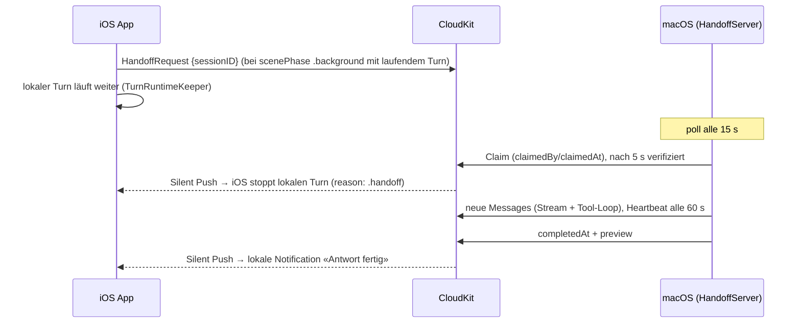

# Server-Handoff (macOS übernimmt laufende Turns)

> Status: **v1 + v2 umgesetzt** (Version 2.5, Stand 2026-08-12).
> v1: CloudKit-Handoff inkl. Notification-Suppression beim Claim-Cancel.
> v2: Completion-Notification auf iOS via Silent Push (CKQuerySubscription).
>
> **Vor jedem TestFlight-Release:** `HandoffRequest` ist ein neues `@Model`
> → CloudKit-Schema muss nach Production deployed werden (Prozedur in
> AGENTS.md; Debug-Build einmal laufen lassen und einen Request schreiben,
> damit der Record-Type in Development existiert — sonst funktioniert auch
> die Push-Subscription nicht).

## Grundidee

Die normale **macOS-Chatter-App** fungiert als Server — kein separates
Binary, kein Toggle, kein Pairing. Sie hat alles Nötige: `ChatEngine`,
`OllamaService`, MCP-Verbindungen und über dieselbe Apple-ID dieselbe
private CloudKit-DB. Jeder Mac mit laufender App ist ein potenzieller
Handoff-Server; die Geräte eines Accounts sind gleichwertig (keine Wahl,
kein Leader).

Der Steuerkanal ist **CloudKit selbst** — kein Listener, kein offener Port,
kein Entitlement, keine Token-Kopplung (die Apple-ID ist die
Authentisierung). Funktioniert über LAN, Tailscale und Internet gleichermassen.

## Ablauf

### Regeln (HandoffCoordinator)

- **Grace**: Ein Request darf frühestens nach 60 s geclaimt werden — die
  lokale Hintergrundlaufzeit des anfragenden Geräts hat Vortritt.
- **Max-Alter**: Requests älter als 2 h gelten als tot (Prune).
- **Claim-Verifikation**: SwiftData hat kein Compare-and-Swap; der Mac
  wartet nach dem Claim 5 s und prüft, dass `claimedBy` noch er selbst ist
  (Zwei-Macs-Rennen).
- **Heartbeat**: Während der Server-Turn läuft, wird `claimedAt` alle 60 s
  erneuert; ein Claim ohne Heartbeat seit > 5 min gilt als abgestürzt und
  darf von einem anderen Mac übernommen werden.
- **Suppression**: Stoppt iOS den lokalen Turn wegen eines Claims
  (`stopTurn(reason: .handoff)`), wird **keine** Completion-Notification
  geschickt und der Request offen gelassen — der Server meldet den Abschluss.
- **Cancel**: Kehrt die App in den Vordergrund zurück, zieht sie ihre
  **eigenen** offenen Requests zurück (`cancelledAt`; Scope über
  `requestedBy` = `AppSettings.deviceID` — Requests anderer Geräte des
  Accounts bleiben unberührt); ein laufender Server-Turn wird davon nicht
  abgebrochen und meldet trotzdem `completedAt`.
- **Dangling Streams**: Der Server schliesst vor dem Turn alle
  `isStreaming`-Flags der Session (das anfragende Gerät kann mitten im
  Stream gestorben sein).

## Komponenten

- `Chatter/Models/HandoffRequest.swift` — der Job-Record (`@Model`, synced).
- `Chatter/Services/HandoffCoordinator.swift` — Claim-Regeln + Query-Helper
  (unit-getestet, `HandoffCoordinatorTests`) + iOS-Push-Subscription
  (`CKQuerySubscription` auf `CD_HandoffRequest`, silent).
- `Chatter/Services/HandoffServer.swift` — macOS-Seite: 15-s-Polling, Claim,
  Turn-Ausführung via `AppEnvironment.runTurn` + `engine.regenerate`.
- iOS-Seite in `AppEnvironment` (`requestHandoffsForActiveTurns`,
  `reconcileHandoffsOnActive`, `handleHandoffPush`) und `ChatterApp`
  (scenePhase-Hook, `UIApplicationDelegateAdaptor` für Silent Pushes).
- `AppSettings.deviceID` — stabile, nicht gesyncte Geräte-ID für Claims.

## Bekannte Grenzen (bewusst akzeptiert)

- **Pickup-Latenz**: bis zu ~15 s Polling + 60 s Grace → der TurnRuntimeKeeper
  überbrückt das lokal; ohne Server exakt das Verhalten von 2.4.
- **Silent Pushes sind best-effort**: Die Completion-Notification kann
  ausfallen; die Daten syncen unabhängig davon, beim nächsten Öffnen wird
  nachgeholt (`reconcileHandoffsOnActive`).
- **Duplikat-Fenster**: Sieht iOS den Claim nicht (suspendiert, Push
  gedrosselt), laufen lokaler und Server-Turn kurz parallel — es entstehen
  ggf. eine halbe lokale und eine volle Server-Antwort in derselben Session.
- **`orderIndex`-Kollisionen** bei echtem Gleichzeit-Schreiben zweier Geräte
  in dieselbe Session bleiben ein generelles Thema (nicht handoff-spezifisch).
- **Lokal-Modus ohne iCloud**: kein Handoff (`Persistence.storeMode ==
  .cloudKit` ist Voraussetzung). Ein Bonjour-Listener als
  sub-Sekunden-/Lokal-Variante bleibt denkbar, ist aber bewusst nicht
  gebaut.
- **API-Key auf dem Mac**: Fehlt er dort (iCloud-Keychain nicht gesynct),
  schlägt der Server-Turn fehl und meldet das als `preview`.

## Verworfene Alternativen

- **Bonjour-Listener (`NWListener` + `POST /handoff`)**: sub-Sekunden-Handoff
  ist ohne User in der App wertlos; die CloudKit-Variante spart Entitlement,
  Pairing, Bonjour-Plist und Angriffsfläche.
- **Server-Modus-Toggle**: unnötig — ohne Requests kostet der Server einen
  billigen Fetch alle 15 s; Zugriffskontrolle ist die Apple-ID.
- **BGTaskScheduler/BGProcessingTask** für den Handoff selbst: muss im
  Voraus geplant werden, nicht für usergestartete Arbeit.
