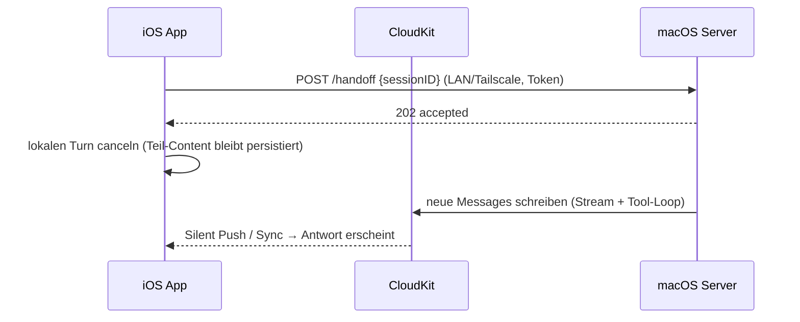

# Plan: Server-Handoff (macOS-Server übernimmt laufende Turns)

> Status: **Idee / noch nicht umgesetzt** (Stand 2026-08-12).
> Vorstufe bereits eingebaut: `BGContinuedProcessingTask` (iOS 26+) bzw.
> `beginBackgroundTask` (iOS 17–25) halten Turns am Leben, solange die App nur
> im Hintergrund ist (`TurnRuntimeKeeper`). Der Server-Handoff bleibt die
> einzige Lösung für «App wurde geschossen» — iOS beendet Continued-Processing-
> Tasks ohne Vorwarnung, wenn die App im App-Switcher weggewischt wird.

## Grundidee

Eine macOS-Server-App (Swift, gleiche Codebasis) läuft dauerhaft auf einem Mac
und ist mit derselben Apple-ID bei iCloud angemeldet → gleiche private
CloudKit-DB (`iCloud.team.budo.chatter`): Sessions, Agents, MCP-Configs,
Knowledge, Skills — alles identisch. Geht die iOS-App in den Hintergrund (oder
soll beendet werden), übergibt sie den laufenden Turn an den Server; das
Ergebnis erscheint via CloudKit-Sync auf allen Geräten.

## Warum der Aufwand klein ist

- `ChatEngine`, `OllamaService`, `MCPConnectionManager`, Tool-Provider und alle
  `@Model`-Klassen sind bereits plattformgeteilt (der Watch-Target linkt sie
  heute schon per Source-Pfad in `project.yml`). Der Server ist im Kern
  «ChatEngine ohne UI»: neues Target in `project.yml`, das
  `Chatter/Models` + `Chatter/Services` + `Persistence.swift` linkt.
- Der Handoff-Aufruf auf Serverseite ist faktisch das vorhandene
  `regenerate(session:agent:context:)`.
- `NSAllowsArbitraryLoads` (LAN/Tailscale-HTTP) ist bereits gesetzt.

## Architektur

### Steuerkanal (nicht CloudKit!)

CloudKit hat Sekunden- bis Minuten-Latenz — ungeeignet als Handoff-Signal.
Direkter Kanal:

- Bonjour-Discovery (`NWBrowser`, Service-Typ `_chatter._tcp`) + kleiner
  HTTP-Endpunkt auf dem Mac (`POST /handoff`).
- Absicherung über geteiltes Token (einmalig per QR/Einstellung gekoppelt).
- Erreichbarkeitsprüfung im Client vor dem Handoff; ohne Server bleibt alles
  beim lokalen Verhalten (TurnRuntimeKeeper).

### Ablauf im Detail

1. iOS bemerkt Hintergrund-Wechsel (`scenePhase`) bzw. drohende Expiration
   des Background-Tasks.
2. Server erreichbar? → `POST /handoff { sessionID }`, dann lokalen Turn
   canceln (Teil-Content bleibt wie bei `CancellationError` stehen).
3. Server lädt die Session aus seinem SwiftData-Store und führt den
   Assistant-Turn aus (Tool-Loop inkl. MCP — stdio-MCP auf dem Mac ohne
   Sandbox-Probleme).
4. Server speichert Messages → CloudKit → iOS zeigt sie beim nächsten Sync;
   zusätzlich lokale Notification «Antwort fertig» (Infrastruktur existiert
   seit 2.4, siehe `TurnRuntimeKeeper`).

## Bekannte harte Punkte

1. **Race um die halbfertige Nachricht**: Beim Handoff existiert lokal schon
   eine Streaming-`Message`. Regel: iOS markiert sie als abgebrochen, der
   Server hängt eine **neue** Assistant-Message an (kein Überschreiben).
2. **`orderIndex` ist nicht gerätesicher**: `session.nextOrderIndex` zählt
   lokal; schreiben zwei Geräte gleichzeitig, kollidieren Indizes. Für den
   Handoff-Fall begrenzbar (iOS hat gestoppt), aber als Dauerzustand braucht
   es eine Regel (z. B. Server nutzt `max(orderIndex)+1` relativ zum eigenen
   Sync-Stand; Clients sortieren tolerant).
3. **Server muss in einer eingeloggten GUI-Session laufen** (LaunchAgent) —
   ein echter headless Daemon kommt an die private CloudKit-DB praktisch
   nicht ran.
4. **API-Key**: iCloud-Keychain synct auf den Mac (gleiche Apple-ID), sonst
   eigener Keychain-Eintrag auf dem Server.
5. **CloudKit-Schema**: jede `@Model`-Änderung muss weiterhin vor TestFlight
   nach Production deployed werden (siehe AGENTS.md).

## Alternativen (verworfen bzw. zurückgestellt)

- **CloudKit als Job-Queue** (`PendingTurn`-Record, Server pollt /
  `CKSubscription`): kein Netzwerkcode nötig, funktioniert übers Internet —
  aber 10–60 s Latenz und schwerer zu deduplizieren. Fallback, falls der
  LAN-Kanal sich als unzuverlässig erweist.
- **BGTaskScheduler/BGProcessingTask**: muss im Voraus geplant werden, nicht
  für usergestartete Arbeit.
- **Background-`URLSession`**: NDJSON-Streaming darüber wäre ein grosser
  Umbau, unverhältnismässig.

## Offene Entscheide bei Umsetzung

- Einbetten als zweites App-Target in diesem Repo (naheliegend, teilt alles)
  vs. eigenes Repo.
- Handoff automatisch bei jedem Hintergrund-Wechsel oder nur bei langen
  Turns / manuell?
- Soll der Server auch **ohne** Handoff autonom Reminder-Actions ausführen
  können (er sieht sie ja in CloudKit)?
